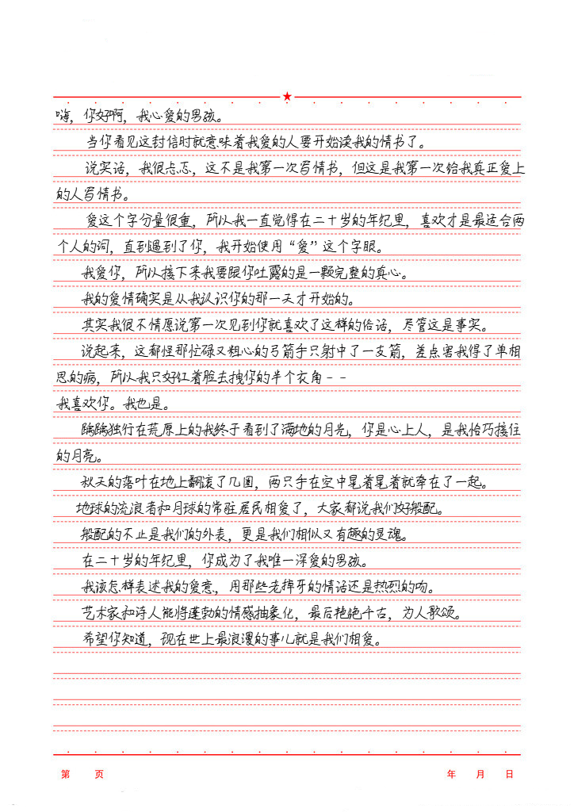

# **HandwritingGenerator**

> HandwritingGenerator 是一个使用 PyQt6 制作的手写文本图片生成器。
>
> 该工具允许用户自定义多种效果，通过在左边配置效果参数，右边实时预览，并在调整好后输出图片。

## 效果预览

一封情书：



## 特点

- **实时预览:** 在左侧配置效果参数时，右侧实时显示生成的手写文本图片，方便用户调整和查看效果。

- **自定义效果:** 用户可以根据需要调整多种效果参数，以生成符合个人喜好或特定场景需求的手写文本图片。

- **方便易用:** 使用直观的界面设计，使用户能够轻松上手，只需通过拖动滑块即可快速调整生成手写文本图片的效果。

- **多样化背景:** 提供常见图片的同时，用户可以选择生成各种尺寸纯色背景，以满足不同设计和应用场景的需求。

## 使用方法

1. **配置效果参数:** 打开 HandwritingGenerator，使用左侧的配置面板调整手写文本图片的效果参数。

2. **实时预览:** 在左侧配置的同时，右侧将实时显示生成的手写文本图片，以便用户可视化调整效果。

3. **输出图片:** 调整好效果参数后，点击导出按钮即可将生成的手写文本图片保存到本地。

## 如何安装

### 下载安装包：

就是项目中的rar文件，解压即可使用。

下载链接：[https://github.com/w-x-x-w/HandwritingGenerator/releases](https://github.com/w-x-x-w/HandwritingGenerator/releases)

### 下载源代码：

使用以下步骤在本地运行 HandwritingGenerator：

```bash
# 克隆仓库
git clone https://github.com/w-x-x-w/HandwritingGenerator.git

# 进入项目目录
cd HandwritingGenerator

# 安装依赖
pip install PyQt6

# 运行应用
python main.py
```

## 后续待增加功能

- 创建渐变色或纹理背景，使用户能够更灵活地定制图片外观。

- 用户更大自由度选择字体而不是只能选择列表项
